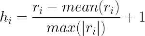

# Shear wave velocity log prediction
Fuzzy Logic, Neural Networks and Genetic Algorithms for shear wave velocity log prediction. [Here](https://nbviewer.jupyter.org/github/EdinsonLeandro/Well_log_predictions/blob/master/Shear-wave-velocity-prediction.ipynb) is the link for the notebook.

## Data normalization.
Perform a normalization implies changing the order of magnitude of the data. It tries to obtain more information making comparable magnitudes, always preserving data integrity. You should use data normalization when you have the following issues:
- **The variables are different nature and magnitude.** It need it because when the data ranges are very different, clustering process gives priority to the variables with higher range.
- **The data can have a non-linear range of variation.** When the slope is close to 90 degrees in some sample points, the values of the slope change faster than when they are close to zero.
- **The data may have an unfavorable statistical distribution.** It is desirable to have more density of data where there are major changes in the function to be identified. It is not always true.

There are different equations to carry out a normalization; however, it was decided use the following equation because it has been used in geosciences:

  

**Repository under construction.**
